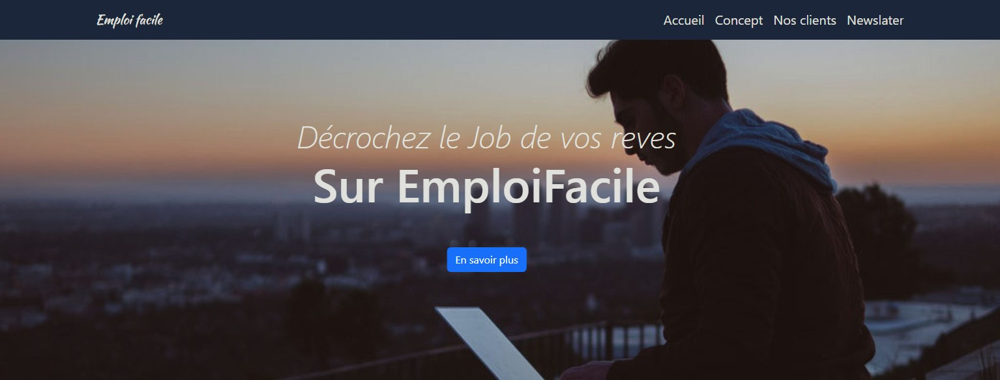

# Entraînement Projet 3 - Utilisation de Bootstrap

## Technologies utilisées

## Table des matières

- [Aperçu](#aperçu)
- [Fonctionnalités](#fonctionnalités)
- [Technologies utilisées](#technologies-utilisées)
- [Prérequis](#prérequis)
- [Installation](#installation)
- [Utilisation](#utilisation)
- [Palette de Couleurs](#palette-de-couleurs)
- [Typographie](#typographie)
- [Contributions](#contributions)
- [Licence](#licence)

## Aperçu

## Fonctionnalités

- Mise en page réactive avec Bootstrap
- Utilisation de SCSS pour les styles personnalisés
- Palette de couleurs définie pour une cohérence visuelle
- Typographie améliorée avec Google Fonts

## Prérequis

- Un serveur web local (ex : [Live Server](https://marketplace.visualstudio.com/items?itemName=ritwickdey.LiveServer) pour Visual Studio Code)
- Un navigateur web moderne

## Installation

1. Clonez le dépôt sur votre machine locale : [Cliquez ici](https://github.com/pascalinecte91/Bootstrap-project-3.git)
2. Ouvrez le projet dans votre éditeur de code.
3. Exécutez `npm init -y` pour créer le fichier `package.json`.
4. Installez Bootstrap avec `npm install bootstrap`.
5. Installez SCSS globalement avec `npm install -g sass`.

## Utilisation

1. Développez votre projet en ajoutant des fichiers SCSS dans le dossier approprié.
2. Compilez les fichiers SCSS en CSS avec `sass --watch scss:css`.
3. Personnalisez les styles dans `style.scss` et assurez-vous de lier le fichier CSS compilé dans votre HTML.

## Palette de Couleurs

| Nom de la Couleur    | Code Hex   | Exemple                   |
|----------------------|------------|---------------------------|
| Dark One             | `#0D1B2A`  |  |
| Mouse                | `#E0E1DD`  |  |
| Main Red             | `#c70a0a`  |  |
| Pallet Blue 1        | `#1B263B`  |  |
| Pallet Blue 2        | `#415A77`  |  |
| Pallet Blue 3        | `#778DA9`  |  |

## Typographie

Ce projet utilise les deux polices suivantes :

1. **Montserrat**
   - **Styles disponibles**: 100, 200, 300, 400, 500, 600, 700, 800, 900
   - **Police**: [Montserrat sur Google Fonts](https://fonts.google.com/specimen/Montserrat)

2. **Kaushan Script**
   - **Styles disponibles**: Regular
   - **Police**: [Kaushan Script sur Google Fonts](https://fonts.google.com/specimen/Kaushan+Script)

### Exemples de texte

### Montserrat (400):

### Playfair Display (400):

